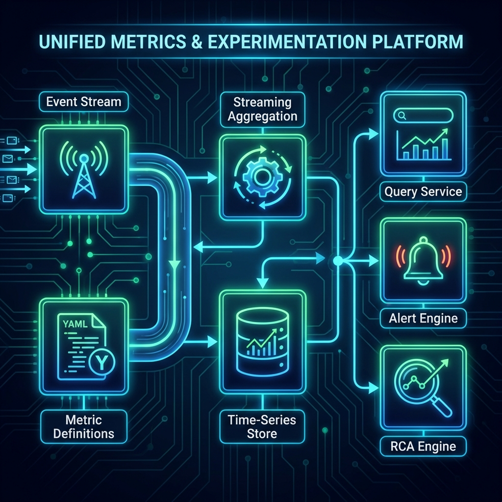
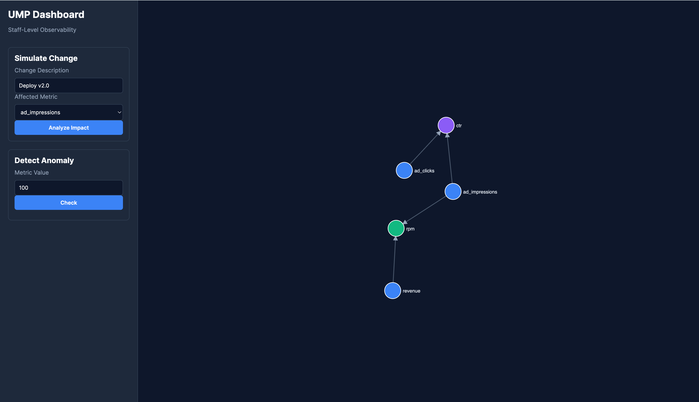

# Unified Metrics & Experimentation Platform




A **Staff-Level** unified platform designed for next-generation observability, combining metrics definition, streaming aggregation, and intelligent root cause analysis (RCA).

## 🚀 Core Philosophy

The platform shifts from passive monitoring to active intelligence by implementing a standard data engineering lifecycle enriched with automated governance:

`Metrics Definition` → `Streaming Aggregation` → `Query Layer` → `Alerting` → `Root Cause Analysis`

---

## 🔑 Key Focus Areas

### 1. 🕸️ Metrics Lineage (指标血缘)
*   **Problem**: "Metric A dropped, but why?" usually involves digging through SQL/Code.
*   **Solution**: Automated extraction of dependencies. We treat metrics as a Directed Acyclic Graph (DAG), mapping raw events → intermediate tables → final metrics.

### 2. ⚡ Change Impact Analysis (变更影响分析)
*   **Problem**: Deployments often break downstream metrics silently.
*   **Solution**: By correlating **Change Events** (Deployments, Config Updates) with the **Lineage Graph**, we can predict and score the potential "Blast Radius" of a change before or immediately after it happens.

### 3. 🤖 Automated Anomaly Detection (自动异常检测)
*   **Problem**: Static thresholds (`if cpu > 80%`) are noisy and rigid.
*   **Solution**: Unsupervised learning models (e.g., Z-Score, Isolation Forest) that learn the "normal" behavior of a metric and flag statistical deviations automatically.

---

## 🛠️ Architecture & Tech Stack (MVP)

*   **Language**: Python 3.10+
*   **API**: FastAPI
*   **Frontend**: HTML5 + D3.js (Interactive visual graph)
*   **Processing**: In-memory streaming (Architecture supports Flink/Spark)
*   **Storage**: In-memory Time-series (Architecture supports ClickHouse/Druid)
*   **Analysis**: Pandas/Scikit-learn

## 📁 Project Structure

```bash
/
├── design/                 # High-level Architecture Documents
├── docs/                   # Documentation & Assets
├── src/
│   ├── api/                # FastAPI Backend
│   ├── web/                # D3.js Dashboard
│   ├── definition/         # Metric DSL & Graph Logic
│   ├── rca_engine/         # Impact Analysis Engine
│   └── alert_engine/       # Statistical Anomaly Detection
├── examples/               # Sample Metric YAML Definitions
└── demo.py                 # CLI Demo Script
```

---

## 🏁 Quick Start

### 1. Prerequisite
Ensure you have Python 3.9+ installed.

```bash
pip install -r requirements.txt
```

### 2. Run the CLI Demo
See the logic in action without the UI.

```bash
python3 demo.py
```

### 3. Launch the Web Dashboard 🖥️
Experience the full interactive platform.

```bash
python3 run_server.py
```
> Open **[http://localhost:8000](http://localhost:8000)** in your browser.

*   **Interactive Lineage Graph**: Drag nodes to visualize dependencies.
*   **Impact Simulator**: "Break" a metric and see the red blast radius.
*   **Anomaly Checker**: Test values against the AI detector.

---

## 🔮 Roadmap

*   [x] **mvp**: In-memory graph & basic anomaly detection.
*   [x] **ui**: D3.js visualization.
*   [ ] **scale**: Move graph to Neo4j/NetworkX-Postgres.
*   [ ] **stream**: Connect to Kafka + Flink for real-time aggregation.
*   [ ] **ai**: Integrate LLMs for "Chat with your Metrics" (RCA Explanations).
