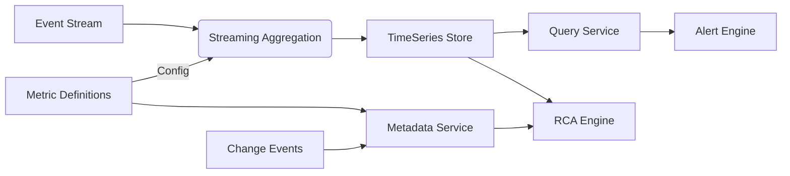

# System Architecture

## 1. High-Level Data Flow

## 2. Key Focus Areas Implementation Strategy

### 2.1 Metrics Lineage (指标血缘)
*   **Concept**: Every basic, derived, or composite metric is a node in a DAG.
*   **Implementation**: 
    *   Parse Metric Definition YAMLs.
    *   Extract source fields and parent metrics.
    *   Build a global dependency graph using `CreateMetric` and `derive_from` attributes.
    *   **Application**: When a metric alerts, traverse the graph *upstream* to find root causes and *downstream* to assess impact.

### 2.2 Change Impact Analysis (变更影响分析)
*   **Concept**: Quantify the impact of a system change (Code Deploy, Config Update) on metrics.
*   **Implementation**:
    *   **Event Overlay**: Ingest "Change Events" (Time, Type, Service, Author).
    *   **Correlation**: When a Change Event occurs, monitor related metrics (via Lineage) for shift in distribution (e.g., K-S Test or plain % change).
    *   **Scoring**: Assign an "Impact Score" to the change based on the magnitude of metric deviation + criticality of the metric.

### 2.3 Automated Anomaly Detection (自动异常检测)
*   **Concept**: Detect shifts without static thresholds.
*   **Implementation**:
    *   **Algorithm**: 
        *   **Seasonality**: RobustSTL for removing seasonal components.
        *   **Local Outlier Factor (LOF)** or **Isolation Forest** for multidimensional metrics.
        *   **Simple Baseline**: Z-Score with sliding window (e.g., 24h) for univariate streams.
    *   **Workflow**: 
        1. Ingest timeseries window.
        2. Forecast expected range.
        3. If actual > expected + tolerance -> Anomaly.

## 3. Module Design

*   **Definition**: declarative YAML files.
*   **Ingestion**: Python-based stream processor (accepting JSON dicts).
*   **Storage**: In-memory Dict/Pandas DataFrame for MVP (extensible to ClickHouse).
*   **RCA**: A service that takes an Anomaly ID -> queries Lineage -> checks Change Events -> returns detailed report.
